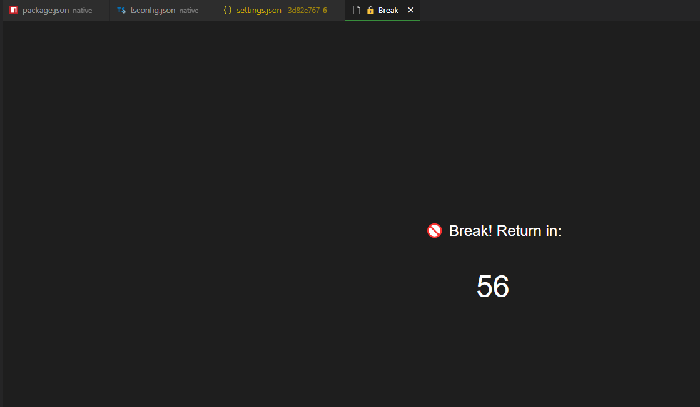
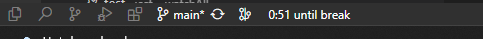

# ⏳ Focus Blocker

**Your personal break enforcer for VS Code.**
Focus Blocker keeps you productive and healthy by **actively reminding you to take breaks** — with a full-screen overlay you can’t ignore.

> No more “just 5 more minutes”. When it’s break time, you’ll know.

In status bar:

---

## ✨ Features

- 🕒 **Automatic Timer** — starts counting down as soon as VS Code launches
- 🚫 **Full-Screen Break Overlay** — gently blocks editing with a countdown
- 🧠 **Status Bar Countdown** — shows time left until your next break
- 🛠 **Simple Settings UI** — change your work/rest durations easily
- 🔁 **Manual Restart Command** — restart the focus timer on demand
- 🌍 **Built-in Localization** — supports **English**, **Русский**, **Українська**

---

## ⚙️ Settings

You can configure the extension via UI (`Focus Blocker: Open Settings`) or manually in your `settings.json`:

| Setting                           | Description                                | Default |
|----------------------------------|--------------------------------------------|---------|
| `focus-blocker.intervalMin`      | Work interval duration in minutes          | `90`    |
| `focus-blocker.breakMin`         | Break duration in minutes                  | `10`    |

---

## 🧩 Commands

| Command                             | Description                          |
|------------------------------------|--------------------------------------|
| `Focus Blocker: Open Settings`     | Open a web-based settings panel      |
| `Focus Blocker: Restart Timer`     | Restart the countdown manually       |

---

## 🧠 Why It Works

Time blocking and micro-breaks improve:
- ✨ Focus
- 📉 Burnout resistance
- 💡 Creativity
- 🧍‍♂️ Posture and physical wellbeing

Focus Blocker helps you automate this rhythm without friction.

---

## 📦 Installation

1. Open the **Extensions** panel in VS Code
2. Search for `Focus Blocker` and install
3. Or run:

```bash
ext install your-publisher.focus-blocker
